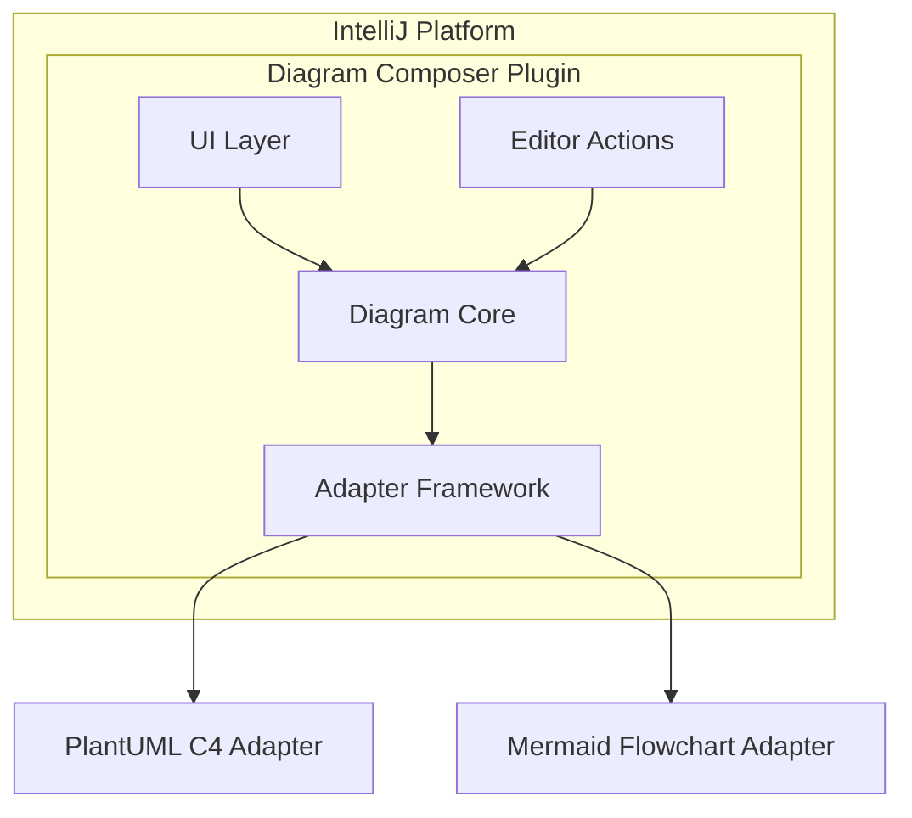
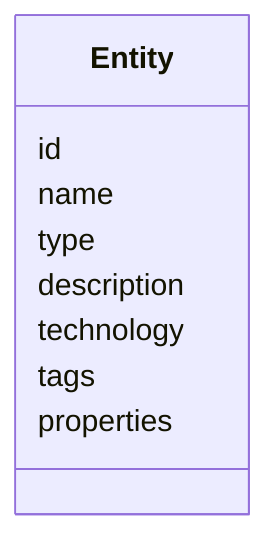
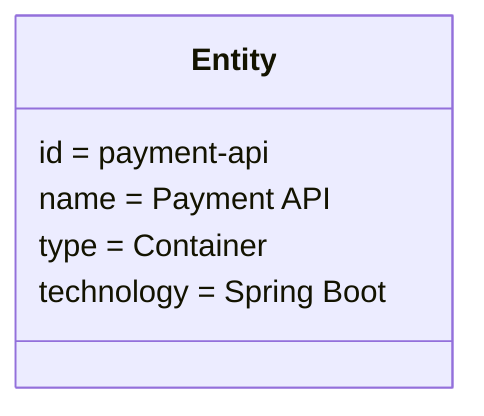
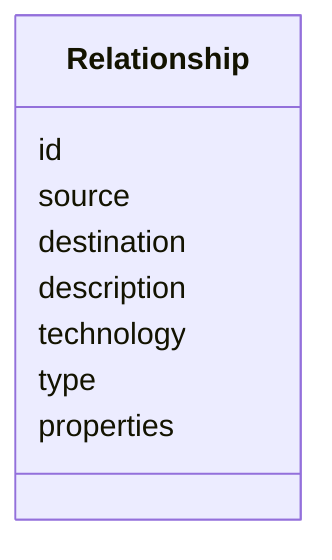
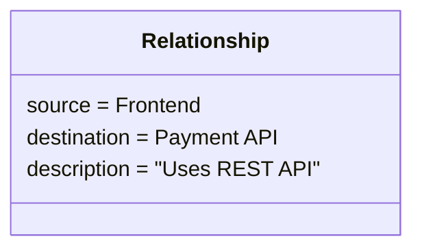
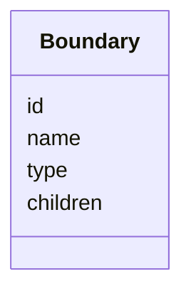
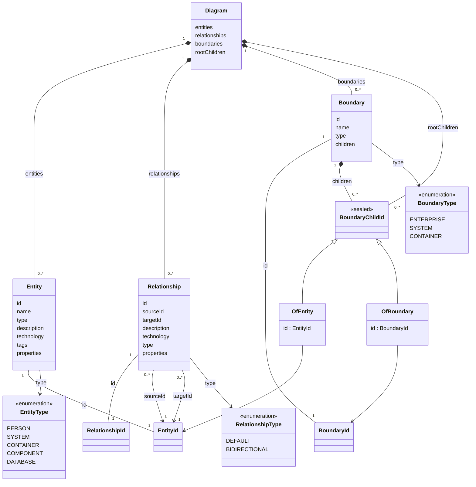
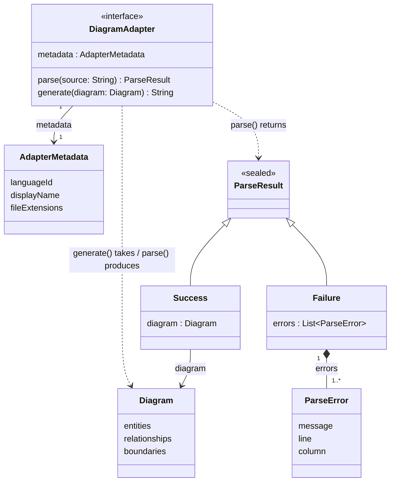

# Diagram Composer Architecture Specification

## 1. Overview

## 1.1 Purpose

This document describes the architecture of the IntelliJ IDEA Diagram Composer plugin.

The plugin provides a visual authoring experience for text-based diagram languages while preserving the benefits of text-based diagrams:

* Version control friendliness.
* Code review compatibility.
* Human-readable source files.
* Integration with existing diagram rendering tools.

The initial supported diagram language is **PlantUML C4**, with the architecture designed to support additional languages such as Mermaid in the future.

---

## 1.2 Design Philosophy

The plugin follows these principles:

### Text remains the source of truth

The underlying diagram source file is authoritative.

The plugin does not create a proprietary diagram format.

Example:

```
Architecture Model

        ↕

PlantUML Source

        ↕

Git Repository
```

---

### Visual editing is an accelerator

The visual editor exists to make writing diagrams faster.

It is not intended to replace text editing.

Users can:

* Edit source directly.
* Use visual tools.
* Switch between both workflows.

---

### Rendering is delegated

The plugin does not implement its own diagram renderer.

Rendering responsibilities remain with existing IntelliJ diagram plugins.

Example:

```
PlantUML Source

       ↓

Existing PlantUML Plugin

       ↓

Rendered Diagram
```

---

### Language independence

The editor must not be coupled to PlantUML.

The architecture separates:

```
Diagram Editor

        ↓

Language-independent Model

        ↓

Diagram Language Adapter

        ↓

PlantUML / Mermaid / Other
```

---

# 2. High-Level Architecture

## 2.1 Component Overview



---

# 3. Module Structure

The project should be divided into independent modules.

All code modules live under a top-level `modules/` directory, so they are visually distinguishable from `docs/`, build files, and other repository-level directories. Gradle module coordinates match the folder path exactly (e.g. `:modules:core`) — there is no shortening indirection.

```
diagram-composer/
└── modules/
    ├── core/
    ├── ui/
    ├── adapter-api/
    ├── adapter-plantuml-c4/
    ├── adapter-mermaid-flowchart/
    └── intellij-plugin/
```

This is the authoritative module layout — other documents reference it rather than redefining it.

---

## 3.1 Core Module

Responsibilities:

* Diagram domain model.
* Graph operations.
* Validation framework.
* Commands.
* Undo/redo model.

The core module must have no dependency on:

* IntelliJ APIs.
* PlantUML.
* Mermaid.

---

## 3.2 UI Module

Responsibilities:

* Diagram canvas.
* Toolbar.
* Property panels.
* Context menus.
* User interactions.

The UI communicates only with the core model.

---

## 3.3 Adapter API Module

Defines the extension contract for diagram languages.

Responsibilities:

* Adapter interfaces.
* Capability definitions.
* Parser contracts.
* Generator contracts.

---

## 3.4 Language Adapter Modules

Adapter modules are scoped to a specific diagram dialect, not just a language — a language may need more than one adapter if its diagram types don't share a common structure mappable to the core model. Examples:

```
adapter-plantuml-c4

adapter-mermaid-flowchart
```

Mermaid flowchart (nodes, edges, subgraphs) maps onto the same `Entity`/`Relationship`/`Boundary` model as PlantUML C4. Other Mermaid diagram types (sequence, class, gantt, etc.) are structurally different — ordered messages, class members, time-based tasks — and would each need their own adapter module (e.g. `adapter-mermaid-sequence`) if and when they're pursued; none is planned currently.

Responsibilities:

* Parse source.
* Generate source.
* Validate syntax.
* Map language constructs to the core model.

---

## 3.5 IntelliJ Plugin Module

Responsibilities:

* Plugin registration.
* File detection.
* Actions.
* Tool windows.
* Editor integration.

---

# 4. Core Domain Model

The core model represents diagrams independently of any language.

## 4.1 Diagram

A diagram contains:

```
Diagram

    Metadata

    Entities

    Relationships

    Boundaries

    Root children (top-level declaration order)

    Styles
```

`Root children` records the declaration order of the entities and
boundaries that sit at the top level (i.e. that aren't a child of any
`Boundary`), the same way a `Boundary`'s own `children` records order for
its nested content (§4.4). Without it, regenerating source from the model
would have no way to know whether a top-level entity was originally
declared before or after a top-level boundary, and re-parsing that
regenerated source would silently reorder it.

---

# 4.2 Entity

An entity represents something in the architecture.

Examples:

* Person.
* System.
* Container.
* Component.
* Database.
* Queue.

Model:



Example:



---

# 4.3 Relationship

Represents communication or dependency.

Model:



Example:


```
Frontend

    ↓  "Uses REST API"

Payment API
```

---

# 4.4 Boundary

Represents logical grouping.

Examples:

* Enterprise boundary.
* System boundary.
* Container boundary.

Model:



---

# 4.5 Class Diagram

Sections 4.1–4.4 above introduce `Diagram`, `Entity`, `Relationship`, and `Boundary` individually. The diagram below shows the same four types together, plus how they relate to one another — composition (a `Diagram` owns its entities/relationships/boundaries), association by id (a `Relationship` connects two `Entity` ids; a `Boundary`'s children are either entity or boundary ids), and each type's enumerated `type` field.

Ids are typed per kind (`EntityId`, `RelationshipId`, `BoundaryId`) rather than plain strings, so a `RelationshipId` can't be passed where an `EntityId` is expected. `BoundaryChildId` is the union of "an entity id" or "a nested boundary id" that a boundary's `children` list holds — this is what lets the model reject a boundary that contains something that doesn't exist (Section 7 "Undo and Redo" invariants aside, this validation happens at construction time in `core`, independent of undo/redo).



Note that `Relationship` and `Boundary` only ever hold *ids*, never direct references to `Entity`/`Boundary` instances — this is what keeps them free-standing value objects rather than requiring a live `Diagram` to construct. `Diagram` itself is responsible for rejecting a relationship or boundary whose ids don't resolve within it (a "dangling reference"), rather than that check living in `Relationship` or `Boundary`. The same applies to `Diagram.rootChildren`; `Diagram` additionally requires every entity and boundary to appear *exactly once* across `rootChildren` and every `Boundary.children` combined, so nothing can be silently omitted from — or duplicated in — generated output.

---

# 5. Adapter Architecture

## 5.1 Adapter Responsibilities

Each language adapter provides:

```
Source Text

    ↓

Parser

    ↓

Core Diagram Model

    ↓

Generator

    ↓

Source Text
```

---

## 5.2 Adapter Interface

Conceptual API:

```kotlin
interface DiagramAdapter {

    fun parse(source: String): Diagram

    fun generate(diagram: Diagram): String

    fun validate(source: String): ValidationResult

    fun capabilities(): AdapterCapabilities

}
```

---

## 5.3 Adapter API — Class Diagram

Section 5.2 sketches the adapter interface conceptually; this is the actual shape implemented in `adapter-api` as of Milestone 2 (`docs/implementation-plan.md`). It's intentionally a smaller surface than Section 5.2's conceptual API — `validate` and `capabilities` are deferred until an adapter exists to motivate their shape (`ai-context.md` §5, "Keep It Simple"). `metadata` replaces a separate `capabilities()` call for now, since Milestone 3's PlantUML C4 adapter only needs a language id and file extensions for IntelliJ file-type association.

`ParseResult` is a sealed result type rather than a nullable `Diagram` or a thrown exception, so callers must handle parse failures explicitly and see every collected `ParseError` at once (`docs/adapters.md` §9 — the parser "must never silently discard information").



`Diagram` here is the same aggregate root defined in Section 4.5 — `adapter-api` depends on `core`'s domain model types but adds none of its own; `DiagramAdapter`, `AdapterMetadata`, `ParseResult`, and `ParseError` are the only new types this module introduces.

---

# 6. Synchronisation Architecture

Synchronisation is a core feature.

The system maintains:

```
Text Document

      ↕

Diagram Model

      ↕

Visual Editor
```

---

## 6.1 Text → Visual

When the user edits source:

```
Document Changed

       ↓

Adapter Parser

       ↓

Update Diagram Model

       ↓

Refresh UI
```

---

## 6.2 Visual → Text

When the user edits visually:

```
User Action

      ↓

Diagram Command

      ↓

Update Model

      ↓

Adapter Generator

      ↓

Update Document
```

---

# 7. Undo and Redo

All visual operations must integrate with IntelliJ undo.

Examples:

* Create entity.
* Delete entity.
* Rename entity.
* Add relationship.
* Change type.
* Modify properties.

Operations should be represented as commands.

Example:

```
CreateEntityCommand

execute()

undo()
```

---

# 8. IntelliJ Integration

Each supported extension is registered as a PSI-backed `LanguageFileType`, not handled through generic file matching. See `docs/engineering.md` Section 2.5 for the concrete extension points (PSI, `FileEditorProvider`, threading, undo) this relies on.

## 8.1 Supported Files

Initial support:

```
*.puml

*.plantuml
```

Future:

```
*.mmd

*.mermaid
```

---

## 8.2 Plugin Components

The plugin provides:

### Editor Extension

Adds:

* Diagram editing pane.
* Toolbar.
* Actions.

---

### Tool Window

Provides:

* Entity explorer.
* Diagram navigation.
* Search.

---

### Inspections

Provides:

* Invalid entities.
* Broken relationships.
* Unsupported syntax.

---

# 9. Rendering Integration

The plugin does not render diagrams.

Example workflow:

```
User edits diagram

        ↓

Plugin updates PlantUML source

        ↓

PlantUML IntelliJ Plugin detects change

        ↓

Preview refreshes
```

---

# 10. Extension Model

Third-party extensions should be able to add:

* New diagram languages.
* New entity types.
* New relationship types.
* New UI actions.

Example:

```
Extension

     ↓

Register Adapter

     ↓

Editor automatically supports language
```

---

# 11. Key Architectural Decisions

## ADR-001: Text is the source of truth

Decision:

Diagram files remain authoritative.

Reason:

* Git friendly.
* Compatible with existing tools.
* Avoids proprietary formats.

---

## ADR-002: No custom renderer

Decision:

Rendering is delegated.

Reason:

* Reduces complexity.
* Uses existing mature tooling.
* Keeps plugin focused on authoring.

---

## ADR-003: Language adapters

Decision:

All languages integrate through adapters.

Reason:

* Supports future expansion.
* Keeps core independent.
* Enables community extensions.

---

## ADR-004: Separate visual editor

Decision:

Visual editing exists separately from the text editor.

Reason:

* Simpler implementation.
* Better user experience.
* Avoids modifying IntelliJ's editor pipeline.

---

**ADR-005: UI technology choice**

Decision:

Use Compose Multiplatform instead of JCEF for the diagram editor UI.

Reason:

* Compose integrates natively with IntelliJ and is more lightweight.
* Compose allows for a more native look and feel within the IDE.
* JCEF would introduce additional complexity and dependencies.
* JCEF is heavier and may introduce performance issues.

---

# 12. Future Extensions

Potential future capabilities:

* Mermaid support.
* Structurizr DSL support.
* Architecture diagram templates.
* AI-assisted diagram generation.
* Architecture linting.
* Dependency analysis from source code.
* Automatic C4 model generation from projects.
* Export to documentation formats.

---

# 13. Summary

The plugin is designed as an extensible diagram modelling framework.

The key architectural choices are:

* Language-independent core model.
* Pluggable diagram adapters.
* Text-first workflow.
* Separate visual editing experience.
* Existing renderer integration.
* IntelliJ-native architecture.
